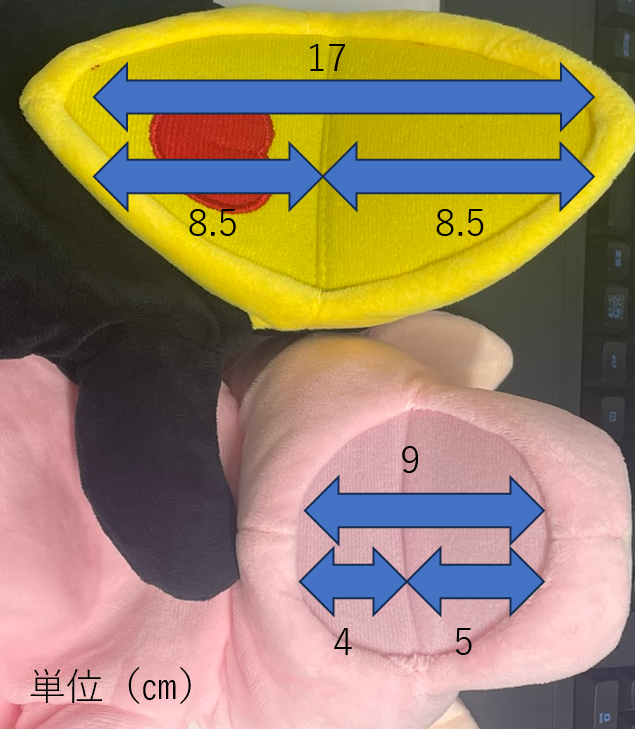
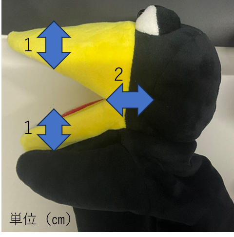
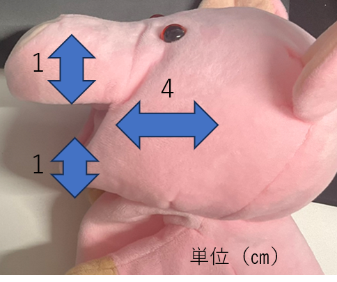

# パペットの寸法について

## くちばしの長さ

- 現在想定している 2 種類(カラス、豚)について、以下の画像に概寸を示す。
  
  ※カラス上、豚下

## 指の入る部分の大きさ
- くちばし先端から頭部までのスペースは、おおむね1㎝程度の指が入るスペースがある。
- どちらもくちばし部分の指の入るスペースは1cm程度だが、頭部のスペースには相違がある。

### カラス

### 豚

